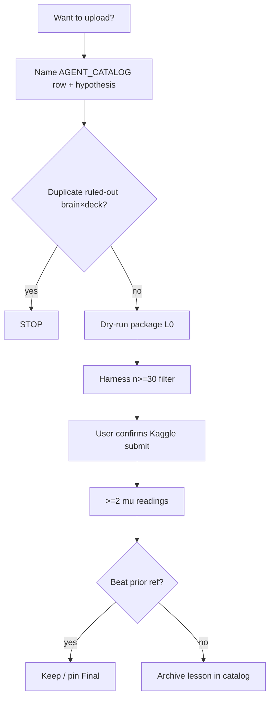

# The Plan — PTCG AI Battle (Session 49, 2026-06-26)

**This is the forward plan.** Backlog: `TASKS.md`. Now: `STATE.md`. Evidence: `eval/AGENT_CATALOG_FULL.md`.

**Competitions**
- **Simulation ladder** (`pokemon-tcg-ai-battle`): public **μ** is the only ship metric.
- **Strategy** (`pokemon-tcg-ai-battle-challenge-strategy`, **deadline 2026-09-14**): stability + deck concept + sim performance + written report.

---

## 0. North star

| Goal | Target | How we know |
|------|--------|-------------|
| **Simulation** | **1000+ μ** sustained (2 readings) | Kaggle public score |
| **Interim bar** | Beat / hold **880.9 μ** (Dragapult v3, ref 53989933) | Ladder |
| **Home-grown** | **> 700 μ** with code in `agent/` | Ladder (today: Search **660.5**) |
| **Strategy comp** | Report + defensible deck/pilot story | Sep 2026 submission |

**Gap to close:** 880.9 → 1000+ is ~120 μ on the ladder. #1 → #2 today is ~220 μ (880.9 vs 660.5). That cliff is **pilot quality**, not deck archetype folklore.

---

## 1. What we know (21 ladder submissions — do not re-litigate)

```
880.9  dragapult_crispin × dragapult_ex_sample     ← only μ ship vehicle
660.5  SearchScorer × real_mega_lucario_ex         ← best our code
659.0  imported Alakazam best5                     ← ported to agent/ (53913404 — do NOT re-upload)
651.3  basic MCTS model4 × Lucario                 ← beats field v5
580.6  field MCTS v5 (25 cycles) × Lucario         ← RETIRED
≤585   Track B learned / wrong-opponent MCTS       ← RETIRED
```

**Laws (from data, not opinion):**
1. **Ladder μ sorts agents.** Local gates, leader-suite L1, and weighted E[win] **misordered** agents (Kyogre 13%→672 μ; LucarioSearch 69.6%→500 μ).
2. **Pilot before deck.** Same dragapult brain on Lucario list → **10%** local (S49). Alakazam: imported 659 vs our Search 545.
3. **More field RL on Lucario hurt.** v5 (580.6) < model4 (651.3) < Search (660.5) on the **same deck**.
4. **Only Dragapult official pilot × official sample clears 800 μ.**

Full decode: [`eval/AGENT_CATALOG_FULL.md`](eval/AGENT_CATALOG_FULL.md)

---

## 2. Operating rules (every session)

1. Read `STATE.md` → `eval/AGENT_CATALOG_FULL.md` → this file.
2. Before **train** or **upload**: name catalog row + one-sentence hypothesis.
3. **Upload gate (R12):** **New brain×deck row only** — check `eval/AGENT_CATALOG_FULL.md` first.
   No re-upload of COMPLETE rows except **final lock-in** near deadline. Then: L0 dry-run → local
   harness **n≥30** (filter) → Kaggle → **≥2 μ readings** (truth).
4. **5 uploads/day**, **2 Finals** — select manually before deadline (`data/SUBMISSION_PLAYBOOK.md`).
5. **Never:** field RL v6+, Dragapult boss levers, `pool_*` opponents, weighted E[win] as sole ship gate, swap pilots onto foreign deck lists, **duplicate ladder uploads (R12)**.

---

## 3. Phased plan

### Phase A — Protect ladder (now)

**Objective:** Hold **880.9 μ**; pin Dragapult v3 as Final when ready.

| Step | Action | Command / artifact |
|------|--------|-------------------|
| A1 | Rebuild tarball | `python scripts/package_dragapult.py` |
| A2 | Dry-run gate @ n=30 (filter) | `python scripts/gate_dragapult.py --games 30 --suite full --report` |
| A3 | Final lock-in only (R12) | Near deadline → `--final-lock-in`; not for development re-probes |
| A4 | Monitor | `python scripts/track_ladder.py` → update `eval/ladder_log.csv` |

**Success:** μ ≥ 880.9 on 2 readings. **No code change** unless legality/stability regression.

---

### Phase B — Home-grown rules uplift (primary path to 700+ μ)

**Objective:** Beat **660.5 μ** (Search) and/or match **659 μ** (imported Alakazam) with `agent/` code.

| Step | Action | Gate |
|------|--------|------|
| B1 | **Port Alakazam best5** into `agent/` | ✅ Dry-run + harness n≥30 — **no ladder re-upload** (659 μ already on 53913404, R12) |
| B2 | **Improve** Alakazam (levers, matchup fixes) | Local n≥30 **beats** port baseline → **new** catalog row → ladder |
| B3 | **LucarioScorer** full suite @ n=30 | `gate_lucario_rules.py --games 30 --suite full --report` |
| B4 | **Ladder probe** LucarioScorer alone (never done; track_c was 535.6 @ 2 games) | μ vs 535.6; compare to Search 660.5 — **new row** |
| B5 | **SearchScorer** targeted improvements on Lucario | Local n≥30 beat 660.5 WR → ladder (**new row**) |
| B6 | **SearchScorer × dragapult_ex_sample** (never on ladder) | Local n≥30 first |
| B7 | **Archaludon ex / Cinderace** — port community v5 + deck tweaks | Local n≥30 full suite; new catalog row if competitive (`eval/archaludon_ex_cinderace_candidate.md`) |

**Order:** B3/B5/B6 for **new** ladder rows. B2 only after measurable local uplift on Alakazam. **B7** when Search/Lucario iteration pauses — Metal archetype for Strategy diversity.

**Success:** Any home-grown row **> 700 μ** on ladder. Pivot μ chase only if **> 880.9** (unlikely without Dragapult-class official pilot).

---

### Phase C — Data science (support decisions, not drive uploads)

**Objective:** Enough replay data to trust mixture weights and meta claims.

| Step | Action | Gate |
|------|--------|------|
| C1 | Expand replay pull | `python scripts/analyze_meta_by_mu_band.py --download-per-band 50` |
| C2 | Rebuild weights | `python scripts/build_field_weights.py` |
| C3 | Refresh meta report | `report/meta/deck_by_mu_band_*.md` |

**Use weights for:** lever prioritization research, report charts. **Do not use for:** upload ship decisions until replay n ≫ 47.

---

### Phase D — Matchup levers (R11 phase 2 — after real pilots)

**Objective:** Per-archetype bonuses only when harness proves **>5pp** with no core regression.

| Step | Action | Gate |
|------|--------|------|
| D1 | Alakazam levers | **Native best5 pilot** as opponent (S46 random pilot = inconclusive) |
| D2 | Trevenant levers | After Trevenant pilot exists |
| — | Dragapult boss levers | **Ruled out S48** |
| — | Abomasnow levers | **Ruled out S45** |

---

### Phase E — Strategy competition report (by Sep 2026)

**Objective:** Written report citing measured evidence.

| Section | Source |
|---------|--------|
| Scoreboard | `eval/AGENT_CATALOG_FULL.md` |
| What failed (RL, Track B, wrong opponents) | `RULINGS.md` Part 2 |
| Pilot×deck lesson | `eval/pilot_deck_matrix_session49.md` |
| Field meta (with caveats) | `report/meta/deck_by_mu_band_*.md` |
| Agent concept | Dragapult ship + rules uplift path |

---

## 4. What we are NOT doing

| Item | Evidence |
|------|----------|
| Lucario field RL v6+ | v5 580.6 < 651.3 < 660.5 |
| Track B LearnedScorer | All ≤585.1 |
| Dragapult boss_order levers | S48 negative/neutral |
| “Lucario deck is out” | Search 660.5 on that deck |
| Training on `pool_*` / Snorlax-only | 185.4 μ Alakazam MCTS |
| ISMCTS / belief priors | **Later** — only if rules plateau < 900 μ after Phase B |
| `agent/` spine refactor (F3) | Until Py≥3.11 smoke passes (R7) |

---

## 5. Decision tree (upload)



---

## 6. Calendar (rough)

| When | Milestone |
|------|-----------|
| **Jun 2026** | Session 49 reset done; Phase A pin; Phase B1 Alakazam port started |
| **Jul 2026** | Home-grown ladder probe(s); meta replay n↑; report outline |
| **Aug 2026** | Simulation deadline ~Aug; Finals selection; target 1000+ μ if Phase B breaks through |
| **Sep 2026** | Strategy comp deadline **2026-09-14**; report + 2 Finals |

---

## 7. Success metrics

| Milestone | Target | Measure |
|-----------|--------|---------|
| Hold | **≥ 880.9 μ** | 2 Kaggle readings |
| Home-grown breakthrough | **> 700 μ** | Ladder, our `agent/` |
| Mid-pack | **1000+ μ** | 2 readings |
| Strategy | Report + stable concept | Sep 2026 comp |

---

## 8. Command cheat sheet

```powershell
cd Z:\kaggle\pokemon

# Evidence
type eval\AGENT_CATALOG_FULL.md

# Phase A — ladder
python scripts/package_dragapult.py
python scripts/gate_dragapult.py --games 30 --suite full --report

# Phase B — rules
python scripts/gate_lucario_rules.py --games 30 --suite full --report
python scripts/package_submission.py --name lucario_ex_search --scorer search --deck agent_decks/real_mega_lucario_ex.csv

# Phase C — meta
python scripts/analyze_meta_by_mu_band.py --download-per-band 50
python scripts/build_field_weights.py

# After upload
python scripts/track_ladder.py
```

---

## 9. Single next action (today)

**Iterate — no duplicate uploads (R12).** B1 port is done. Next: **B3** LucarioScorer gate @ n≥30
(never properly laddered) or **B5** Search improvements — each must be a **new catalog row** before upload.

Parallel idle work: Phase C1 meta download on user machine.

**Do not:** re-upload Alakazam best5 (53913404), Dragapult without change, or Lucario v5 for μ.
