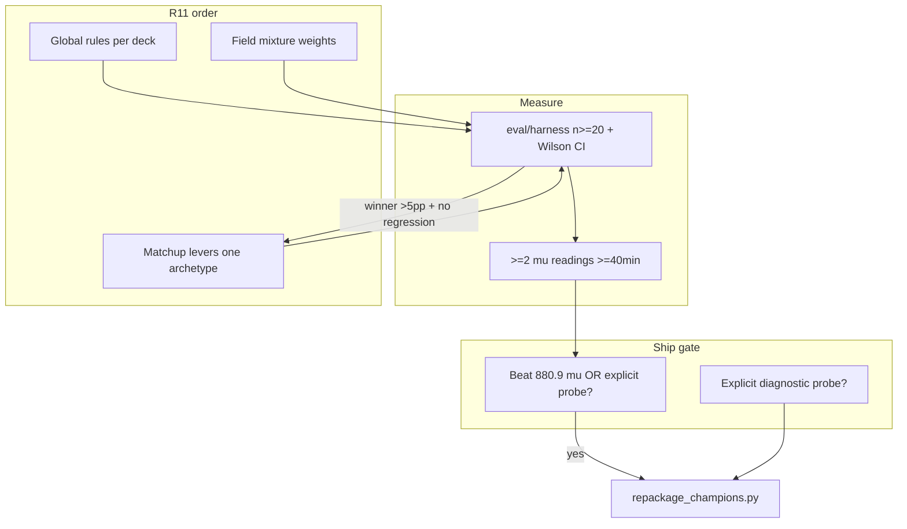

# Research & Decision Brief — PTCG AI Battle Challenge

**Generated:** 2026-06-26 (Session 49)  
**Purpose:** Synthesis of measured ladder evidence, competition rules, and decision process.  
**Canonical refs:** [`eval/AGENT_CATALOG_FULL.md`](../eval/AGENT_CATALOG_FULL.md) (every submission decoded) · [`RULINGS.md`](../RULINGS.md) · [`STATE.md`](../STATE.md)

---

## 1. Executive summary

After **49 sessions** and **21 COMPLETE ladder submissions**, the data is unambiguous:

1. **Only Dragapult official pilot × official sample deck clears 800 μ** (880.9).
2. **Best home-grown code is SearchScorer × real Lucario (660.5 μ)** — not field RL.
3. **25-cycle field RL+MCTS v5 (580.6 μ) regressed** vs basic model4 (651.3) and Search on the **same deck**.
4. **Pilot before deck** is a 100+ μ effect (imported Alakazam 659 vs our Search 545; dragapult brain on Lucario list → 10% local).
5. **Local gates do not sort agents** — use ladder μ for decisions; harness n≥30 as filter only.

| Track | Agent | μ | Role |
|-------|-------|--:|------|
| **Ladder ship** | Dragapult v3 (53989933) | **880.9** | Only μ > 800 |
| **Home-grown ceiling** | SearchScorer × Lucario (53869254) | **660.5** | Improve rules/search — not RL |
| **External benchmark** | imported Alakazam best5 (53913404) | **659.0** | Port into `agent/` |
| **Ruled out** | Lucario v5 field MCTS (53995982) | **580.6** | No more field RL spend |

**Meta (manifest 5,426 episodes):** Matchmaking volume concentrates μ **800–1200**. **Replay deck parsing: 47 games** — too thin for mixture weights; expand before R3 ship gates.

**Infrastructure:** `eval/harness.py`, `field/registry.json`, Wilson CI — local filter at n≥20/30, not truth.

---

## 2. Competition rules (decision constraints)

Source: [`data/CABT_API.md`](../data/CABT_API.md), [`data/COMPETITION_SCORING.md`](../data/COMPETITION_SCORING.md).

### Two competitions

| Competition | Deadline | What counts |
|-------------|----------|-------------|
| **Simulation** (`pokemon-tcg-ai-battle`) | ~Aug 2026 | Public **μ** on TrueSkill ladder |
| **Strategy** (`pokemon-tcg-ai-battle-challenge-strategy`) | **2026-09-14** | Stability + deck concept + sim performance + written report |

### Agent contract

- `agent(obs_dict) -> list[int]` — legal indices into `obs["select"]["option"]` every decision.
- **One illegal move = forfeit.** Empty bench when a Basic could be benched → `no_active` loss (real μ sink).
- **10 minutes total clock per player** (cumulative think time).

### Scoring

- Skill = **N(μ, σ²)**. Each episode updates μ on **win / loss / draw only**.
- **Margin and speed do not change μ** per episode (but fast losses still hurt because they're losses).
- μ ≈ 600 at COMPLETE = initialized rating after self-validation — **not** field strength.
- **5 uploads/day**; **2 Final Submissions** selected manually for judging.

### Information model (load-bearing)

| Visible | Hidden |
|---------|--------|
| Our hand, both boards, discards, stadium | Opponent hand (count only), deck order, face-down prizes |

This is an **imperfect-information POMDP**. Correct tools: belief states, determinized search (ISMCTS/PIMC), not perfect-info assumptions.

---

## 3. Operating mindset (Part 0 — governs everything)

1. **Measure; never assume** — verify against engine, real field, repeated μ readings.
2. **Simplicity wins** — earn complexity only when it beats the rules floor on the real-field gate.
3. **Pilot before deck** — same deck swung **474 μ** (Alakazam 659 vs MCTS ~185).
4. **Real field only** — no `pool_*` proxies, random, or mirror-only training as ladder truth.
5. **Ship nothing ungated** — L0–L2 local, then ≥2 μ readings ≥40 min apart.
6. **One thing at a time** — sequential gated work; one source of truth per concern (R10).
7. **880.9 μ is the interim bar, not the goal** — field top ~1350; #2 submission is 660.5 μ (~220 μ cliff).

---

## 4. Standing rulings (R1–R11)

| ID | Ruling |
|----|--------|
| **R1** | Trust no single μ reading; require ≥2 readings ≥40 min apart. |
| **R2** | Gate on mined real decks + public agents only. |
| **R3** | Rules/search is the floor; ML must beat it on real-field gate + ladder before ship. |
| **R4** | Fix pilot before chasing new decks. |
| **R5** | Imperfect information — belief/determinized search, not naive minimax. |
| **R6** | No in-game learning; retrain between submissions only. |
| **R7** | Never crash; bench ≥1 Basic when legal; don't refactor `agent/` spine until smoke passes. |
| **R8** | Every win-rate reports games, opponents, seeds, deck, brain. |
| **R9** | Optimize win probability + stability, not blowout margin. |
| **R10** | One doc per concern: RULINGS / STATE / ARCHITECTURE / this brief in `report/`. |
| **R11** | **Rules → levers → mixture.** Meta weights inform phase 3 only; never skip phases 1–2. |

---

## 5. Measured scoreboard (ladder μ — 21 COMPLETE)

**Full decode:** [`eval/AGENT_CATALOG_FULL.md`](../eval/AGENT_CATALOG_FULL.md) · **Sorted:** [`eval/ladder_scoreboard_full_20260626.md`](../eval/ladder_scoreboard_full_20260626.md) · **Log:** [`eval/ladder_log.csv`](../eval/ladder_log.csv)

| Rank | Brain × deck | μ | Verdict |
|------|--------------|----:|---------|
| 1 | Dragapult v3 rules + bench guard | **880.9** | Only μ ship track |
| 2 | SearchScorer × real Lucario | **660.5** | Best home-grown |
| 3 | Imported Alakazam best5 | **659.0** | Port pilot |
| 4 | Basic MCTS model4 × Lucario | **651.3** | Beats field v5 MCTS |
| 5 | Field MCTS v5 (25 cycles) | **580.6** | **Ruled out** |
| 6–21 | Kyogre, Trevenant, Track B, early MCTS, … | 185–626 | See catalog |

**Do not use** stale “668 μ Search” or “850.5 Dragapult v2” — settled readings are **660.5** and **833.0**.

---

## 6. What we tried — evidence summary

### Agents / brains

| Approach | Best μ | Verdict |
|----------|-------:|---------|
| Official Dragapult + wrapper + bench guard | **880.9** | **Only >800 μ** |
| SearchScorer | **660.5** (Lucario deck) | **Best our code** — improve this |
| LucarioScorer / smart bench | 535.6 (2 eps) | Ladder probe needed |
| Imported Alakazam rules | **659.0** | Port, don't retrain RL first |
| Basic RL+MCTS (notebook) | **651.3** (Lucario) / **185.4** (Alakazam Snorlax) | Narrow opponents poison brain |
| Lucario field RL+MCTS v5 | **580.6** | **Worse than model4 + Search — retired** |
| Track B PPO + distill | ≤585.1 | Retired |
| Deck GA / robust search | ≤626 | Retired |
| AlphaZero self-play | 9.7% public gate | Retired |

**Lesson:** **Ladder μ sorts agents.** Local pool WR, leader-suite L1, and weighted E[win] **misordered** Kyogre, Trevenant, and LucarioSearch.

### Decks / archetypes (mined field)

| Deck | Best μ | Best brain on that deck |
|------|-------:|-------------------------|
| Dragapult ex (official sample) | **880.9** | Official Crispin only |
| Mega Lucario ex (real) | **660.5** | SearchScorer (not field MCTS) |
| Alakazam (mined) | **659.0** | Imported best5 (not our Search 545.6) |
| Kyogre | **633.0** | HeuristicScorer |
| Trevenant | **615.6** | SearchScorer |
| Abomasnow | **548.6** | SearchScorer |
| `pool_*` proxies | n/a | **Invalid eval opponents** |

### Evaluation methods

| Method | Trust level |
|--------|-------------|
| n=10 local gates without CI | **Noise** (S45: 30–50% swings) |
| n≥20 + Wilson CI via harness | **Filter** — use before lever decisions |
| Real-field gate (`eval/harness.py`) | **Filter** — n≥30 + Wilson; **misordered vs μ historically** |
| Weighted E[win] (`field/weights.json`) | **Assumption** until replay n≫47 |
| Kaggle μ (2+ readings) | **Ground truth for ship/pivot** |

---

## 7. Session 45–48 local measurements (harness)

### Dragapult baseline (S48, n=20, native opponents, weighted)

| Opponent | WR% | Weight |
|----------|----:|-------:|
| real_mega_lucario_ex | **80.0** | 0.45 |
| real_dragapult_ex | 75.0 | 0.12 |
| real_iono | 60.0 | 0.08 |
| dragapult_ex_sample | 50.0 | 0.12 |
| real_mega_abomasnow_ex | 45.0 | 0.06 |

- **Overall:** 62.0% [52.2, 70.9]
- **Weighted E[win]: 70.5%** @ n=20 — **not** a ship gate (S49: ladder is truth)
- **Dragapult boss levers (Phase 2b):** v1/v2 **-10pp** vs Lucario; v3 neutral on full suite → **zeros kept**

Source: `eval/dragapult_baseline_session48.md`

### Lucario rules baseline (S46, n=20, full suite)

| Opponent | WR% | 95% CI |
|----------|----:|--------|
| dragapult_ex_sample | 30.0 | [14.5, 51.9] |
| real_mega_abomasnow_ex | 25.0 | [11.2, 46.9] |
| real_iono | 75.0 | [53.1, 88.8] |
| real_dragapult_ex | 40.0 | [21.9, 61.3] |
| real_mega_lucario_ex (mirror) | 50.0 | [29.9, 70.1] |
| **Overall** | **44.0** | [34.7, 53.8] |

Source: [`eval/lucario_rules_baseline_session46.md`](../eval/lucario_rules_baseline_session46.md)

### R2 lever iterations

| Matchup | Change | Result | Decision |
|---------|--------|--------|----------|
| Dragapult psychic `boss_orders` 700→900 | +13.3pp local (3-opp, n=10) | Packaged, not on ladder | Optional probe upload |
| Abomasnow water boss/gust sweep (S45) | v2/v3 −20pp | No winner >5pp | **Ruled out** |
| Alakazam psychic sweep (S46) | vs random pilot | 100% all variants | **Inconclusive** — need real pilot |

### Session 49 — pilot×deck (local, n=30)

| Brain | Deck | Overall WR |
|-------|------|----------:|
| dragapult_agent | dragapult_ex_sample | 62.0% |
| dragapult_agent | real_mega_lucario_ex | **10.0%** |
| LucarioScorer (S46) | real_mega_lucario_ex | 44.0% @ n=20 |

Source: [`eval/pilot_deck_matrix_session49.md`](../eval/pilot_deck_matrix_session49.md)

### Dragapult R2 / strategy (corrected)

**Do not** frame “Dragapult chases μ; Lucario is hub deck” without catalog context: Lucario **deck** achieved **660.5 μ** with SearchScorer. Field MCTS on that deck **regressed**. Dragapult wins on μ via **matched official pilot only**.

---

## 8. Field meta & μ-band analysis (new, S47)

### Episode manifest (5,426 games, 06-19 index)

Where the ladder spends matchmaking effort (by mean μ of both agents):

| μ band | Episodes | % of sample | Mean avg μ |
|--------|----------|------------:|-----------:|
| elite 1200+ | 154 | 2.8% | 1239 |
| high 1000–1199 | 3,067 | **56.5%** | 1059 |
| mid 800–999 | 2,204 | **40.6%** | 973 |
| rising 600–799 | 0 | 0% | — |

**Implication:** Most ladder games happen between **μ 800–1200**. Breaking 880 is necessary but not sufficient — mid-pack requires competing in the **1000+ band** where most volume lives.

### Replay deck analysis (47 games, 2026-06-26 pull)

Recent replay sample (see [`report/winner_analysis_20260626.md`](winner_analysis_20260626.md)):

- **Win conditions:** 67% ko_race, 24% board_wipe, 9% deck_out
- **Median length:** 12 turns
- **First-player edge:** ~51% (negligible at n=45)
- **Archetype WR (n≥20 appearances):** Dragapult **55.6%**, Lucario **48.3%**

Stratified sample (small n — directional only): at **elite μ**, Alakazam beat Lucario 3/4 in head-to-head; in **recent unbanded pulls**, Dragapult dominated Lucario 7/8 seats.

Full report: [`report/meta/deck_by_mu_band_2026-06-26.md`](meta/deck_by_mu_band_2026-06-26.md)

### Leaderboard snapshot (2026-06-26)

| μ | Team (inferred archetype from name) |
|--:|-------------------------------------|
| 1397.8 | Yushin Ito |
| 1326.8 | keidroid |
| 1317.3 | tomatomato |
| 1302.3 | Shun |
| 1272.4 | Kadoraba (Alakazam line) |

Source: `report/leaderboard_snap_20260626_session47.csv`

---

## 9. Decision process (how we choose what to do next)



### Per-lever decision (R2)

1. Baseline n≥20 vs target opponent (official pilot when available).
2. Sweep variants via `scripts/test_lever_variant.py` with `lever_overrides` param.
3. Winner only if **>5pp AND Wilson lower bound beats baseline lower bound**.
4. Core suite regression check (dragapult, abomasnow, iono).
5. Optional ladder probe; compare μ to prior ref.

### Per-upload decision

- **Default:** Must beat **880.9 μ** (Dragapult) for μ chase, or beat **660.5 μ** (Search) for home-grown progress — 2 stable readings each.
- **Probe exception:** Logged catalog row + hypothesis (e.g. ported Alakazam best5 vs 659 μ).
- **Never:** Ship field RL v5 again; use weighted E[win] as sole gate; rush Finals before deadline.

---

## 10. Strategy tracks (Session 49 — ladder-grounded)

| Track | Goal | Evidence-based action |
|-------|------|------------------------|
| **μ ladder** | Sustain / beat **880.9** | Dragapult v3 only (`package_dragapult.py`) |
| **Home-grown rules** | Close gap toward 700+ | Improve SearchScorer (660.5); port Alakazam best5 (659) |
| **Lucario deck** | Not dead — wrong pilots were | Search 660.5 > field MCTS 580.6 on same list |
| **Strategy comp** | Sep 2026 report | Cite `AGENT_CATALOG_FULL` + pilot×deck lesson |
| **Meta data** | Support mixture later | Download 50/band; **not** ship weights at n=47 replays |

**Not doing:** field RL v6+; Dragapult boss levers; Lucario v5 re-upload for μ; `pool_*` eval.

---

## 11. Explicitly ruled out (do not re-run)

- Lucario field MCTS v5 **additional** cycles (580.6 < 651.3 model4 < 660.5 Search)
- Abomasnow boss/gust lever sweeps (S45 negative)
- Dragapult boss_order levers (S48 negative/neutral)
- Track B PPO, deck GA, AZ, Snorlax-only MCTS training
- n=10 lever decisions without Wilson CI
- Proxy opponent eval (`pool_*`, random as field truth)
- Upload decisions from weighted E[win] alone
- Parallel top-level handoff markdown files (use STATE + catalog)

Graveyard code: branch `graveyard/pre-reset-20260622`.

---

## 12. Next actions (Session 50)

1. **Upload discipline (R12)** — `check_upload_eligible.py` before every submit; ports end at dry-run.
2. **SearchScorer iteration** on Lucario — beat **660.5 μ** locally then ladder as **new** row.
3. **Alakazam levers** — local gate > **62%** before upload vs **659 μ**.
4. **Meta:** `--download-per-band 50` before trusting `field/weights.json`.
5. **LucarioScorer @ 39.3%** — measured; **do not upload** (below 55% minimum).

See `STATE.md` for the single prioritized next action.

---

## 13. Artifact index

| Topic | Path |
|-------|------|
| **Agent catalog (21 submissions)** | `eval/AGENT_CATALOG_FULL.md` |
| **This brief** | `report/RESEARCH_AND_DECISION_BRIEF.md` |
| Rulings + evidence | `RULINGS.md` |
| Current state | `STATE.md` |
| μ-band meta | `report/meta/deck_by_mu_band_2026-06-26.md` |
| Winner analysis | `report/winner_analysis_20260626.md` |
| Lucario baseline S46 | `eval/lucario_rules_baseline_session46.md` |
| Lever reports | `eval/lucario_r2_lever_iteration_report_20260626.md`, `eval/abomasnow_full_suite_session45.md` |
| Harness | `eval/harness.py`, `field/registry.json` |
| Resubmit commands | `data/SUBMISSION_REGISTRY.md` |
| Competition rules | `data/CABT_API.md`, `data/COMPETITION_SCORING.md` |
| Ladder history | `report/ladder_history.csv`, `eval/ladder_log.csv` |
| Episode manifest | `report/replays/manifest.csv` (5,426 episodes) |

### Refresh commands

```powershell
cd Z:\kaggle\pokemon
python scripts/track_ladder.py
python scripts/analyze_meta_by_mu_band.py --download-per-band 10
python scripts/analyze_winners.py --replays report/replays
python scripts/gate_lucario_rules.py --games 20 --suite full --report
```

---

*Every number in this brief ties to a file in §13. If evidence conflicts, `RULINGS.md` Part 1 and fresh ladder readings win.*
