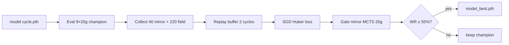
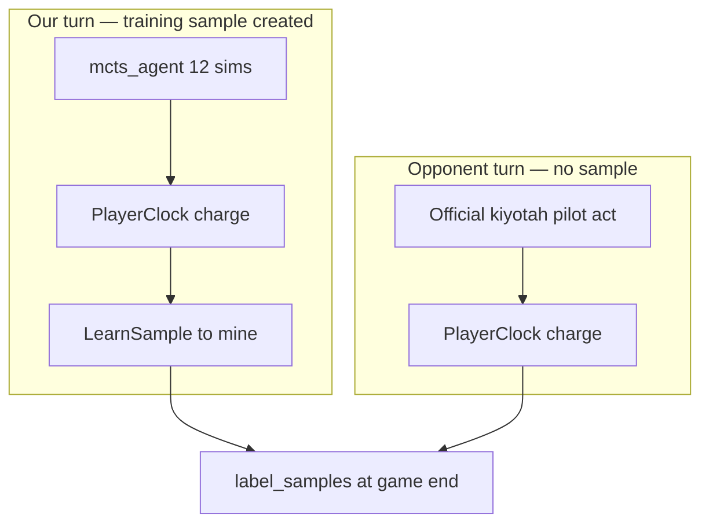
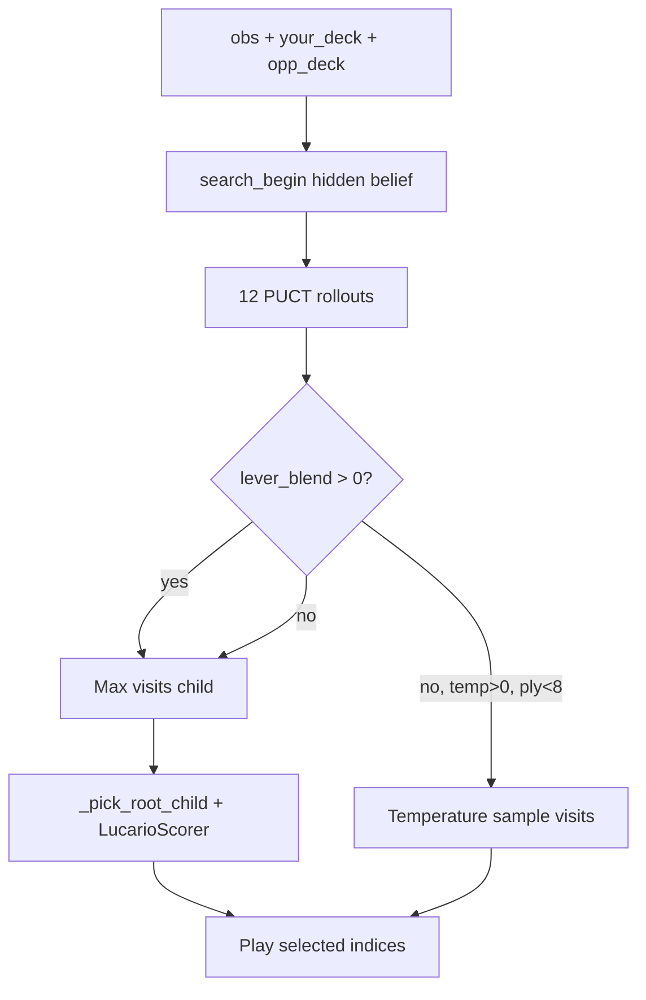
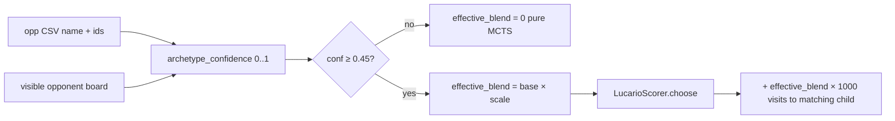
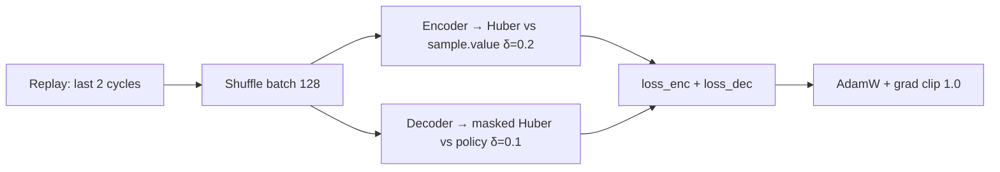

# Lucario training — reward & policy visual

**Recorded:** 2026-06-22 (companion to FIELD_TRAIN_SPEC_20260622_1730.md)  
- **Interactive canvas:** `canvases/lucario-training-reward-policy.canvas.tsx` (open in Cursor sidebar)  
**Ground truth:** code paths below — not planned features

---

## High-level: one training cycle



**Files:** `scripts/train_lucario_field_mcts.py` main loop (~line 631)

---

## The only reward signal

There is **no step reward**. Episode ends → terminal scalar → back-propagated onto MCTS samples from **our turns only**.

### Terminal mapping (`label_samples`, `lucario_mcts_runtime.py`)

| Simulator `result` | Our label |
|--------------------|-----------|
| `your_index` (we win) | **+1.0** |
| opponent index (we lose) | **-1.0** |
| `2` (draw) | **0.0** |
| Clock forfeit (`PlayerClock` > 599s) | Loser gets loss label |

```python
# lucario_mcts_runtime.py — label_samples
if terminal_result == 2:
    value = 0.0
elif terminal_result == your_index:
    value = 1.0
else:
    value = -1.0
for sample in reversed(samples):
    sample.value = (value + sample.value) * 0.5
    value = value * VALUE_LAMBDA + sample.value * (1.0 - VALUE_LAMBDA)  # λ=0.9
```

### What is NOT rewarded

- Per-turn margin, prize count, damage dealt
- Kaggle ladder μ
- Beating a specific archetype (only W/L/draw)
- Opponent mistakes

---

## Sample collection (who moves how)



**Collection:** `collect_vs_opponent` in `train_lucario_field_mcts.py`  
- `temp = 1.0` if `ply < TEMP_PLIES` (8), else `0.0`  
- `add_noise=True` passed but **not used** inside `mcts_agent`

---

## MCTS decision policy (our move)



### Policy targets (within one search, before game ends)

```python
# mcts_agent — after search
sample.value = root.total / root.visit
policy[i] = clip(child_value - base, -1, 1)
# unexpanded child: min_value - base - 0.03
```

### MCTS terminal in search tree (`create_node`)

| End state | Backprop value |
|-----------|----------------|
| We win | +1 |
| We lose | -1 |
| Draw | 0 |

---

## Soft masking / deck scope (lever gating)

**Not** NN action masking yet — gates **how hard** LucarioScorer levers push MCTS at root.



**Files:** `agent/deck_scope.py`, `_pick_root_child` in `lucario_mcts_runtime.py`  
**Lever deltas:** `agent/matchup_levers.py` → consumed in `lucario_policy.py` `_score_option`

---

## Gradient update (train_on_samples)



**MyModel today:** encoder (value) + decoder (policy). **No opponent head.**

---

## Promotion gate (not field reward)

```python
gate_wr = eval_vs_model(candidate, champion, deck, GATE_GAMES)  # 20 games
promoted = gate_wr >= GATE_WINRATE  # 0.55
```

Both sides = MCTS on **same Lucario deck** (mirror). Field eval WR does not gate.

---

## Default numbers (from code)

| Constant | Value |
|----------|-------|
| VALUE_LAMBDA | 0.9 |
| SEARCH_COUNT | 12 |
| TEMP_PLIES | 8 |
| PLAYER_CLOCK_LIMIT_SEC | 599 |
| SCOPE_CONFIDENCE_FLOOR | 0.45 |
| GATE_WINRATE | 0.55 |
| REPLAY_ITERS | 2 |
| games/cycle collect | 260 (40+220) |
| lever_blend (fresh run) | 0.40 |

---

## Future (documented, not in code)

- **Opponent head** on universal card encoder → archetype embedding → scoped policy adapter
- Dirichlet noise at MCTS root (`add_noise` stub)
